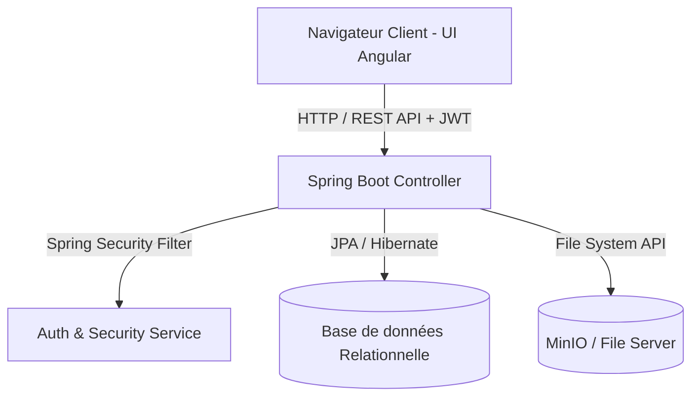

# Spécifications Fonctionnelles et Techniques - Application GRH
*Système de Gestion des Ressources Humaines, de l'Organigramme et des Congés*
**وزارة الداخلية - الجمهورية التونسية (نظام التصرف في الموارد البشرية والرخص)**

---

## 📋 Table des Matières
1. [Introduction & Vision Métier](#1-introduction--vision-métier)
2. [Traduction Métier ➡️ Technique (Business to Technical Mapping)](#2-traduction-métier-️-technique-business-to-technical-mapping)
   - 2.1 [Gestion de l'Organigramme (الهيكل التنظيمي)](#21-gestion-de-lorganigramme-الهيكل-التنظيمي)
   - 2.2 [Gestion des Dossiers des Agents (ملفات الأعوان والإطارات)](#22-gestion-des-dossiers-des-agents-ملفات-الأعوان-والإطارات)
   - 2.3 [Moteur de Gestion des Congés & Autorisations (إدارة الرخص والإجازات)](#23-moteur-de-gestion-des-cong%C3%A9s--autorisations-إدارة-الرخص-والإجازات)
   - 2.4 [Tableau de Bord & Reporting (لوحة القيادة والتقارير)](#24-tableau-de-bord--reporting-لوحة-القيادة-والتقارير)
3. [Architecture Technique & Cartographie Applicative](#3-architecture-technique--cartographie-applicative)
4. [Dictionnaire de Correspondance (Métier ➡️ Code)](#4-dictionnaire-de-correspondance-m%C3%A9tier-️-code)
5. [Politique de Sécurité et Profils Utilisateurs (RBAC)](#5-politique-de-securit%C3%A9-et-profils-utilisateurs-rbac)

---

## 1. Introduction & Vision Métier

L'application **GRH** est une solution web sur-mesure conçue pour numériser, centraliser et automatiser les processus administratifs liés aux ressources humaines du **Ministère de l'Intérieur Tunisien** (spécifiquement adapté aux structures de formation de la sécurité et de la police nationale). 

L'objectif métier est de passer d'une gestion papier traditionnelle (registres physiques des congés, dossiers agents voluminieux, organigrammes statiques) à un **système d'information dynamique, réactif et sécurisé**.

---

## 2. Traduction Métier ➡️ Technique (Business to Technical Mapping)

### 2.1 Gestion de l'Organigramme (الهيكل التنظيمي)
* **Besoin Métier :** Représenter graphiquement et hiérarchiquement la structure administrative (Directions Générales, Sous-directions, Services, Écoles) afin d'y affecter les agents.
* **Traduction Technique :** 
  * Structure de données en arbre (Tree Structure) auto-référencée via une entité JPA `OrgUnit` (avec association `parentUnit`).
  * Interface frontend sous forme de d'arbre interactif (Tree View) permettant la création, modification et suppression des unités administratives en cascade.
  * Validation métier : Empêcher les dépendances cycliques (une unité ne peut pas être son propre parent).

### 2.2 Gestion des Dossiers des Agents (ملفات الأعوان والإطارات)
* **Besoin Métier :** Suivre le cycle de vie administratif de l'agent (Fiche d'identité, situation familiale, grade, diplômes, formations, stages, et pièces jointes).
* **Traduction Technique :**
  * Entité principale `Personnel` liée à plusieurs entités secondaires en composition (`Child`, `Diploma`, `TrainingStage`).
  * Système d'archivage logique (Soft Delete) : Les agents supprimés ne sont pas effacés physiquement de la base de données, mais marqués comme `archived` pour préserver l'historique légal des congés et des états financiers.
  * Stockage d'images (Photos de profil) : Téléchargement asynchrone des fichiers vers un serveur d'objets (MinIO ou stockage local sécurisé) avec réécriture dynamique des URLs pour l'affichage Angular.
  * Onglets dynamiques (Tabs) pour la séparation des domaines métier (Identité, Famille, Carrière).

### 2.3 Moteur de Gestion des Congés & Autorisations (إدارة الرخص والإجازات)
* **Besoin Métier :** Traiter les demandes et le suivi des trois types de congés réglementaires :
  1. *Congés Annuels* (الإجازات السنوية)
  2. *Congés Exceptionnels* (الرخص الاستثنائية)
  3. *Congés Maladie* (إجازات المرض)
* **Traduction Technique :**
  * **Calculateur de Solde :** Algorithmes backend calculant en temps réel les jours consommés et restants par année civile (Ex: limite stricte de 30 jours par an pour le congé annuel).
  * **Calculateur de Dates :** Gestion automatique des chevauchements de dates, exclusion ou inclusion des jours fériés/week-ends selon le règlement administratif.
  * **Intégrité Référentielle :** Bloquer toute nouvelle demande si un congé actif (dont la période intersecte la demande) existe déjà pour l'agent concerné.
  * **Cycle de Validation :** Workflow d'approbation (Brouillon ➡️ Validé ➡️ Rejeté).

### 2.4 Tableau de Bord & Reporting (لوحة القيادة والتقارير)
* **Besoin Métier :** Connaître instantanément l'état opérationnel quotidien (Qui est présent ? Qui est en congé aujourd'hui ? Répartition démographique).
* **Traduction Technique :**
  * Agrégations SQL quotidiennes (`COUNT`, `GROUP BY`) pour extraire les totaux globaux et par type de congé.
  * **Filtres temporels dynamiques :** Sélection des congés dont la date actuelle est comprise entre `start_date` et `end_date`.
  * **Interface Interactive :** Composants de type cartes cliquables (`stat-card`) déclenchant un défilement automatique fluide (`scrollIntoView`) ou une redirection vers les modules correspondants.
  * **Générateur PDF/Impression :** Feuille de style CSS `@media print` dédiée pour reformater la page web en rapport administratif épuré prêt à être imprimé ou exporté au format PDF officiel.

---

## 3. Architecture Technique & Cartographie Applicative

L'application repose sur une architecture découplée de type **SPA (Single Page Application)** robuste :

* **Frontend (Présentation) :** Angular (v17+), composants autonomes (Standalone Components), programmation réactive avec RxJS, design basé sur CSS3 moderne avec flous de verre (Glassmorphism) et animations fluides (Transitiions Keyframes).
* **Backend (Métier & Données) :** Spring Boot, Spring Security (Authentification Stateless par jeton JWT), Hibernate/JPA, Java 17.
* **Stockage :** Base de données SQL (PostgreSQL/MySQL), Serveur de fichiers MinIO pour les images et documents.

---

## 4. Dictionnaire de Correspondance (Métier ➡️ Code)

| Terme Métier (Arabe) | Concept Métier (Français) | Variable / Entité Technique | Type de Données |
| :--- | :--- | :--- | :--- |
| **المعرف الوحيد** | Matricule / Numéro d'enregistrement | `registrationNumber` | `String` (Unique) |
| **عون / إطار** | Agent / Personnel | `Personnel` | `Entity` |
| **الهيكل التنظيمي / المصلحة** | Unité Organisationnelle / Service | `OrgUnit` | `Entity` (Self-referential) |
| **رتبة** | Grade | `grade` | `String` / `Enum` |
| **رخصة سنوية** | Congé Annuel | `AnnualLeave` | `Entity` |
| **رخصة استثنائية** | Congé Exceptionnel | `ExceptionalLeave` | `Entity` |
| **عطلة مرضية** | Congé Maladie | `SickLeave` | `Entity` |
| **تاريخ استئناف العمل** | Date de retour / Reprise de service | `returnDate` | `LocalDate` |
| **الأبناء** | Enfants de l'agent | `Child` | `Entity` (One-To-Many) |
| **التربصات والتكوين** | Stages et Formations | `TrainingStage` | `Entity` (One-To-Many) |

---

## 5. Politique de Sécurité et Profils Utilisateurs (RBAC)

Le système implémente un contrôle d'accès basé sur les rôles (Role-Based Access Control) strict pour cloisonner les fonctionnalités :

1. **`ROLE_SUPER_ADMIN` (المشرف العام) :**
   * *Fonctions Métier :* Administration globale du système, gestion complète de l'organigramme (`OrgUnit`), purge/suppression des congés erronés.
   * *Accès Technique :* Droits complets en écriture (`POST`, `PUT`, `DELETE`) sur toutes les APIs.
2. **`ROLE_ADMIN_DIRECTION` / `ROLE_AGENT_RH` (شؤون الموظفين) :**
   * *Fonctions Métier :* Gestion quotidienne des agents, saisie des dossiers, validation des demandes de congés et édition des rapports administratifs.
   * *Accès Technique :* Restriction d'accès à la configuration globale, accès complet au module `/personnel` et `/leaves`.
3. **`ROLE_USER` (الموظف العادي) :**
   * *Fonctions Métier :* Consultation du solde personnel de congés, soumission de demandes individuelles de congés.
   * *Accès Technique :* **Redirection automatique de sécurité** vers `/my-annual-leaves` à la connexion. Accès interdit aux pages administratives (/dashboard, /personnel, /organization).
